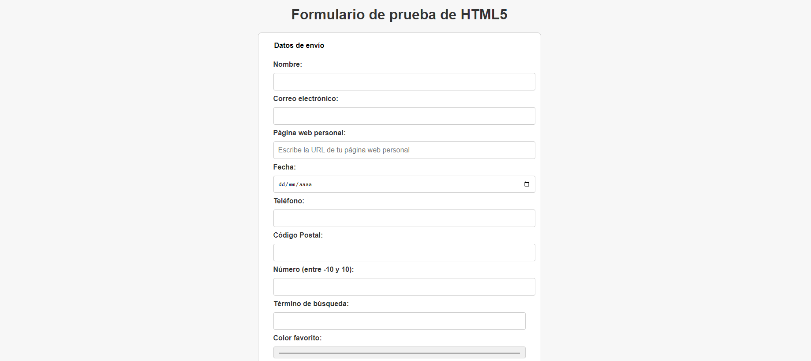
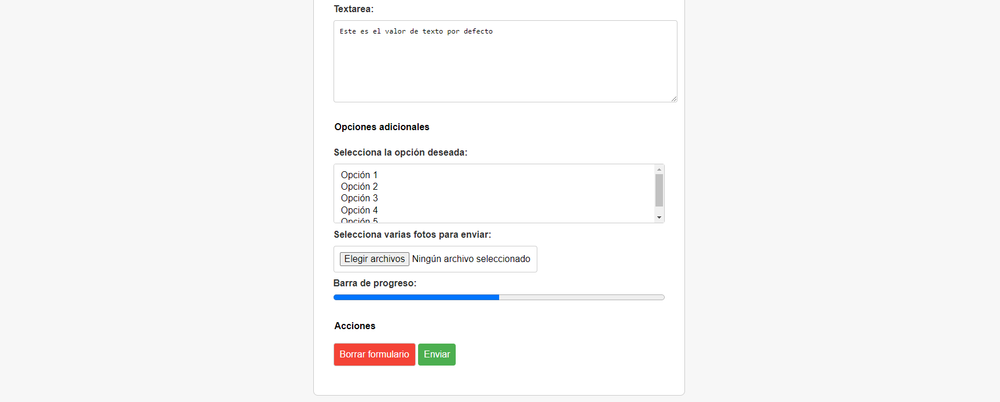

# Reto 1.5: Formulario
Nombre y Apellidos: Pablo Rodríguez Crespo
URL del repositorio de gitlab: https://github.com/Pablosax9/ODAW2_RETO.1.5-Formulario.git
## Instrucciones:
Crea una página web que contenga un formulario con los siguientes campos de información, conservando los datos del fichero Reto1.5_base.html:

1. Nombre: Un campo de texto obligatorio que debe aceptar entre 3 y 50 caracteres alfabéticos (solo letras y espacios). El campo debe tener el cursor activado automáticamente.
2. Correo electrónico: Un campo de tipo email obligatorio que valide que el usuario ingrese un correo electrónico válido.
3. Página web personal (opcional): Un campo de tipo url donde el usuario pueda ingresar la URL de su página web. Este campo es opcional.
4. Fecha: Un campo de tipo date donde el usuario pueda seleccionar una fecha. Este campo es obligatorio.
5. Teléfono: Un campo de tipo tel que valide que el número de teléfono ingresado tenga entre 7 y 15 dígitos, y que opcionalmente pueda incluir el prefijo internacional (+).
6. Código Postal: Un campo de tipo text obligatorio que solo permita ingresar un número de 5 dígitos (usa una expresión regular).
Número: Un campo de tipo number donde el usuario pueda ingresar un número entre -10 y 10.
1. Búsqueda: Un campo de tipo search donde el usuario pueda ingresar un término de búsqueda.
2. Color favorito: Un campo de tipo color donde el usuario pueda seleccionar su color favorito.
3. Texto adicional: Un campo de tipo textarea obligatorio donde el usuario pueda ingresar un texto, limitado a un máximo de 100 caracteres.   
Crea un segundo bloque de opciones adicionales:
1.  Un campo de tipo select con opción de seleccionar múltiples valores, donde el usuario pueda elegir entre cinco opciones predefinidas.
2.  Un campo de tipo file que permita la selección de varias fotos en formato JPEG.
3.  Una barra de progreso (progress) que muestre un valor del 50%.
4.  El **título** de la página debe ser "tu nombre y apellidos".
5.   Añade la etiqueta **label** en los inputs.
6.   Deben de llevar el atributo title las etiquetas que lo necesiten.

 

Ejemplo final:

